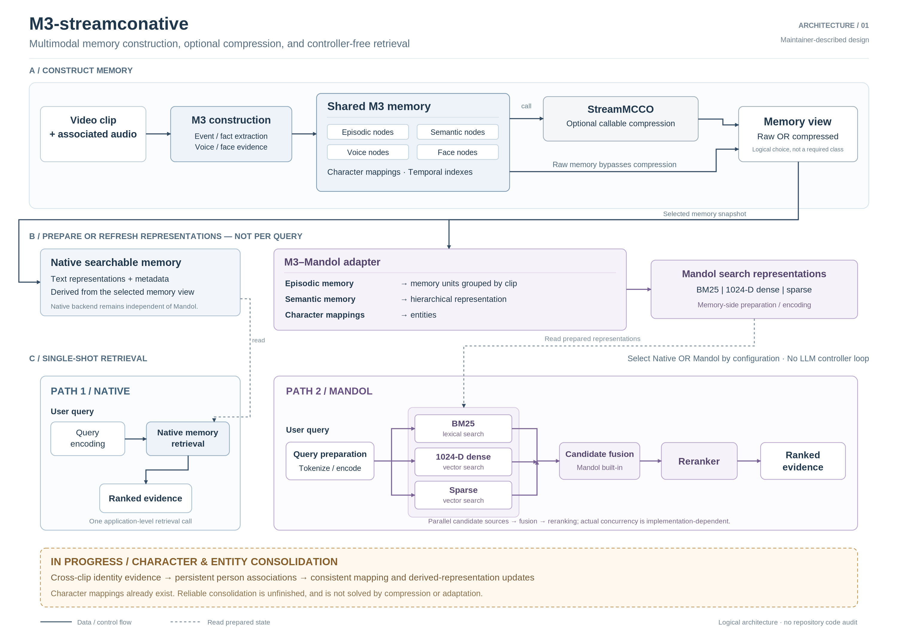

# M3-streamconative

> Multimodal streaming memory with optional compression and two controller-free retrieval paths.

M3-streamconative builds structured memory from video clips and associated audio. It retains episodic, semantic, voice, and face evidence alongside character mappings and temporal indexes. Queries use either M3's native retrieval path or an adapter to Mandol's hybrid retrieval stack.

## Contents

- [Architecture](#architecture)
- [Memory construction](#memory-construction)
- [Callable compression](#callable-memory-compression)
- [Retrieval](#retrieval)
- [Current scope](#current-scope)
- [Documentation](#documentation)

## Architecture

<p align="center">
  
</p>

```text
Video clip + audio
  → M3 memory construction
  → Shared multimodal memory
      ├─ episodic nodes
      ├─ semantic nodes
      ├─ voice nodes
      ├─ face nodes
      ├─ character mappings
      └─ temporal indexes
  → raw memory or explicit StreamMCCO compression
  → selected retrieval backend
      ├─ native M3 retrieval
      └─ M3–Mandol adapter → Mandol hybrid retrieval
  → ranked evidence
```

Compression is optional: it is not a mandatory stage for every clip or query. Native M3 and Mandol retrieval are alternatives, not consecutive searches.

## Memory construction

The construction pipeline consumes a clip and its associated audio.

| Component | Role |
| --- | --- |
| Episodic nodes | Clip-grounded events, actions, and observations. |
| Semantic nodes | Extracted facts and semantic descriptions. |
| Voice nodes | Speaker-related audio evidence or features. |
| Face nodes | Visual identity evidence or features. |
| Character mappings | Associate face/voice evidence with character identifiers. |
| Temporal indexes | Support access by clip and time. |

Character identifiers and temporal indexes organize memory; they are not separate text-memory node types. A character identifier also does not prove that every observation of the same real person has been merged. Persistent identity consolidation remains ongoing work.

## Callable memory compression

The StreamMCCO-derived compression algorithm is a callable operation over existing memory. It can run separately from construction and retrieval.

- Retrieval may use either raw memory or the output of compression.
- Any retrieval representation must match the memory version being searched.
- The architecture diagram describes the logical choice; it does not assert a particular selector implementation.

Compression scope, mutation behavior, scheduling, and return type require source-level confirmation. This document does not assume every node modality is compressed the same way.

## Retrieval

### Native M3

```text
User query → query encoding → native memory retrieval → ranked evidence
```

The application makes one retrieval call. There is no LLM controller loop that selects successive searches, inspects intermediate results, or reformulates the query. Internal encoding, ranking, metadata lookup, and evidence assembly remain compatible with this application-level contract. Answer generation is separate from retrieval.

### Mandol adapter

The adapter translates M3 memory into Mandol-compatible representations without making Mandol a dependency of the native path.

| M3 source | Mandol-side representation |
| --- | --- |
| Episodic memory | Memory units grouped into clip-based spaces. |
| Semantic memory | Hierarchical-memory-like representation. |
| Character mappings | Entity representation. |

The current design specifies clip grouping, not a fixed parent-group size or exact hierarchy levels.

```text
                          ┌─ BM25 lexical search ────┐
Query → tokenize / encode ├─ 1024-D dense search ───┼→ candidate fusion → reranker → ranked evidence
                          └─ sparse-vector search ───┘
```

BM25, dense, and sparse search are parallel candidate sources. The 1024-dimensional setting applies to dense representations, not sparse vectors. Adapter representations are prepared during ingestion or refresh rather than rebuilt conceptually from the complete graph for every query; exact scheduling and caching require code verification.

## Current scope

| Component | Status |
| --- | --- |
| Clip/audio multimodal memory construction | Present, as reported by the maintainer. |
| Character mappings and temporal indexes | Present, as reported by the maintainer. |
| Callable StreamMCCO compression | Present, as reported by the maintainer. |
| Native single-shot retrieval | Present, as reported by the maintainer. |
| M3–Mandol adapter and hybrid retrieval | Present, as reported by the maintainer. |
| Persistent character/entity consolidation | In progress. |

Consolidation addresses who an observation belongs to over time. Compression addresses representation and redundancy. They are distinct operations; compression should not be presented as resolving fragmented identity.

## Documentation

| Document | Purpose |
| --- | --- |
| [Architecture](ARCHITECTURE.md) | Data flow, representation mappings, dependency contracts, and the consolidation boundary. |
| [Mandol adapter](mandoladaptor.md) | Adapter design contract. |
| [GPU pipeline requirements](GPU_PIPELINE_REQUIREMENTS.md) | Runtime and deployment requirements. |
| [Hyperstack runbook](HYPERSTACK_GPU_RUNBOOK.md) | GPU execution guidance. |
| [TST algorithm specification](TST_ALGORITHM_SPEC.md) | TST conventions and algorithm details. |
| [Experiment record](experiment_GPU_record.md) | Traceable experiment history. |

## Dependencies and boundaries

Both retrieval paths depend on M3 memory and their required representations. Native retrieval does not require the Mandol adapter. The Mandol path requires the adapter, lexical/dense/sparse representations, query preparation, candidate fusion, and a reranker. StreamMCCO is needed only when compression is explicitly invoked. Consolidation is not a completed prerequisite for either retrieval path.

Concrete model choices, execution location, storage, package versions, and launch commands should be taken from the implementation rather than inferred from this overview.
